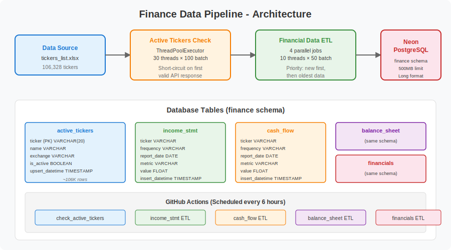

[](https://github.com/psf/black)
[](https://pycqa.github.io/isort/)
[](https://ahnazary.github.io/Finance/)

# Finance Data Pipeline



<br />

📖 **[Full Documentation](https://ahnazary.github.io/Finance/)**

## Overview

An automated financial data pipeline that collects stock financial statements (income statements, cash flow, balance sheets, and financials) from Yahoo Finance for **106,000+ tickers** worldwide and stores them in a cloud-hosted PostgreSQL (Neon) database in a normalized long-format schema.

## Key Features

- **106K+ Tickers**: Validates and tracks active tickers across global exchanges
- **4 Financial Statement Types**: Income Statement, Cash Flow, Balance Sheet, Financials
- **Parallel Processing**: Multi-threaded HTTP calls (configurable threads) for high throughput
- **Incremental Updates**: Prioritizes new tickers, then refreshes oldest data
- **Idempotent Jobs**: Safe to re-run; uses upsert/delete+insert patterns

## Architecture

```
┌─────────────────┐     ┌──────────────────┐     ┌─────────────────┐
│  Ticker Excel   │────▶│  Active Tickers  │────▶│   Financial     │
│  (106K tickers) │     │  Check Job       │     │   Data ETL Jobs │
└─────────────────┘     └──────────────────┘     └─────────────────┘
                               │                         │
                               ▼                         ▼
                        ┌──────────────────────────────────────┐
                        │    Neon PostgreSQL (finance schema)   │
                        │                                      │
                        │  • active_tickers (106K rows)         │
                        │  • income_stmt (long format)          │
                        │  • cash_flow (long format)            │
                        │  • balance_sheet (long format)        │
                        │  • financials (long format)           │
                        └──────────────────────────────────────┘
```

## Quick Start

```bash
# Install dependencies
pip install -r finance/requirements.txt

# Run active tickers check (validates tickers against Yahoo API)
python -m finance.src.run_active_tickers_check --mode single --threads 30

# Run financial data ETL (for any of the 4 tables)
python -m finance.src.run_financial_etl --table income_stmt --max-batches 5
python -m finance.src.run_financial_etl --table cash_flow --max-batches 5
python -m finance.src.run_financial_etl --table balance_sheet --max-batches 5
python -m finance.src.run_financial_etl --table financials --max-batches 5
```

## Configuration

All job parameters are defined in [`config.py`](config.py):

| Parameter | Default | Description |
|-----------|---------|-------------|
| `ACTIVE_TICKERS_BATCH_SIZE` | 100 | Tickers per batch for validity check |
| `ACTIVE_TICKERS_THREADS` | 30 | Concurrent threads for ticker validation |
| `ETL_BATCH_SIZE` | 50 | Tickers per batch for financial data fetch |
| `ETL_THREADS` | 10 | Concurrent threads for data fetching |

## Database Schema

All financial tables use a **long (melted) format**:

| Column | Type | Description |
|--------|------|-------------|
| `ticker` | VARCHAR | Stock ticker symbol |
| `frequency` | VARCHAR | "annual" or "quarterly" |
| `report_date` | DATE | Financial report date |
| `metric` | VARCHAR | Metric name (e.g., "annualTotalRevenue") |
| `value` | FLOAT | Numeric value |
| `insert_datetime` | TIMESTAMP | When the row was inserted |

## Project Structure

```
Finance/
├── config.py                          # Central configuration
├── finance/
│   ├── requirements.txt               # Python dependencies
│   ├── src/
│   │   ├── postgres_interface.py      # SQLAlchemy DB connection
│   │   ├── etl_job.py                 # Active tickers validation job
│   │   ├── financial_data_etl.py      # Financial data fetching jobs
│   │   ├── run_active_tickers_check.py # CLI runner for ticker check
│   │   ├── run_financial_etl.py       # CLI runner for financial ETL
│   │   └── data/
│   │       └── tickers_list.xlsx      # 106K tickers source file
│   └── tests/
├── .github/workflows/                 # GitHub Actions CI/CD
├── docs/                              # Sphinx documentation
└── README.md
```

## What Problem Does It Solve?

### 📈 Access to Historical Data
Yahoo Finance only provides the last 4 quarters/years of financial data. This pipeline accumulates data over time, building a growing historical database.

### 🔍 Easy Access via SQL
Instead of scraping Yahoo Finance manually for each company, query thousands of companies at once with SQL.

### 🎯 Filtering by Financial Metrics
Filter and rank companies across any financial metric (revenue, net income, EPS, etc.) using standard SQL queries.

## License

MIT License - see [LICENSE](LICENSE) for details.
