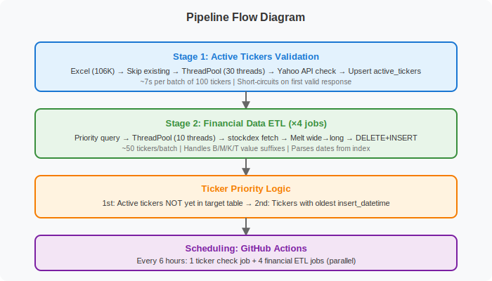

Finance Data Pipeline
=====================

.. image:: images/architecture_diagram.svg
   :width: 100%
   :align: center
   :class: rounded

|

An automated financial data pipeline that collects stock financial statements from Yahoo Finance
for **106,000+ tickers** worldwide and stores them in a cloud-hosted PostgreSQL database.

|

Key Features
------------

- **106K+ Global Tickers** validated against Yahoo Finance API
- **4 Financial Statement Types**: Income Statement, Cash Flow, Balance Sheet, Financials
- **Multi-threaded Execution** for high throughput (configurable concurrency)
- **Incremental Updates**: New tickers first, then refresh stale data

|

Pipeline Flow
-------------

|

Quick Start
-----------

.. code-block:: bash

    # Install dependencies
    pip install -r finance/requirements.txt

    # Set up environment
    export PG_NEON_FINANCE_URL="your-connection-string"

    # Run active tickers check
    python -m finance.src.run_active_tickers_check --mode single --threads 30

    # Run financial data ETL
    python -m finance.src.run_financial_etl --table income_stmt --max-batches 5

What Problem Does It Solve?
---------------------------

**📈 Historical Data Accumulation**
    Yahoo Finance only shows the last 4 quarters/years. This pipeline builds a growing historical database over time.

**🔍 SQL Access to Financial Data**
    Query thousands of companies at once with standard SQL instead of manual scraping.

**🎯 Cross-Company Filtering**
    Filter and rank companies by any financial metric (revenue, EPS, margins, etc.).

Quick Links
-----------

- `GitHub Repository <https://github.com/ahnazary/Finance>`_
- `stockdex Package <https://pypi.org/project/stockdex/>`_ (underlying data source)
